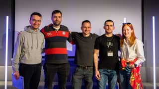
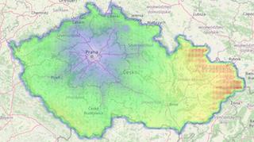
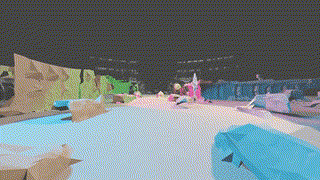
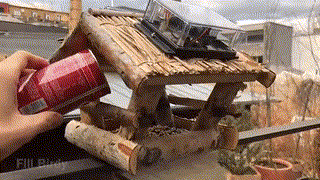
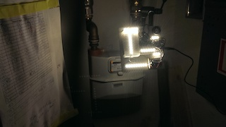

### About Me

My name is Pavel and I’m a software engineer. I work mostly with <b>Python</b> and <b>Django</b> to create systems related to machine learning. 
I’m a <b>Certified Kubernetes Application Developer</b> (CKAD) and have the ability to create, monitor and scale systems running on Kubernetes.  

💻 **Tech stack**: 
* **Python, Django, DRF, Postgres**
  * 5+ years of experience 
  * My projects [Where to live](https://wtl.pavelkral.eu), [OptiFleet](https://zero.pavelkral.eu), [Django on Cloud Run](https://github.com/pavelkraleu/cloud-run-django)
* **Kubernetes, Docker**
  * [CKAD certification](https://ti-user-certificates.s3.amazonaws.com/e0df7fbf-a057-42af-8a1f-590912be5460/19b128b7-59c0-566b-8661-7a21756a52d5-pavel-kral-certified-kubernetes-application-developer-ckad-certificate.pdf)
* Helm, Pulumi  

💪 **Things I like**: 3D Printing, Hardware, Machine learning

### My Projects

<table border="0">

<tr><td>

<a href="https://github.com/pavelkraleu/deepclean"><b>Deep-Learning</b></a> - 
I've collected a collection of Prague's graffiti images and harnessed the mighty neural networks. 💪

Using these neural networks, I've created a dynamic duo! 👥 The first network expertly pinpoints graffiti within the images, while the second wields its magic to envision what the image would look like without those pesky tags. 🎨
</td></tr>

<tr><td>

<a href="https://www.linkedin.com/posts/katerina-vackova_ai-gpt-yes-activity-7056530132324245504-Q8lw/"><b>Prague AI Hackathon</b></a> - 
We won the shiny second place medal 🥈 out of 10 teams on Prague AI hackathon. Our project involved scrutinizing GPT-4's medical responses by consulting it with real doctor 🩺
</td></tr>

<tr><td>

<a href="https://github.com/pavelkraleu/game-of-life"><b>Game of life</b></a> -
I made this during my time at CVUT FIT. It's a Game of Life in C++, but with a twist. Instead of just a static start, you can input a PNG image that gets thresholded and becomes the initial state. Plus, I added my own special mode with 🌟 stars that explode when their life ends, randomly changing their surroundings.
</td></tr>

<tr><td>

<a href="https://wtl.pavelkral.eu/"><b>Where to Live</b></a> - 
I created this little tool that calculates all sorts of commuting details, how much gas you would use or how much precious time you'll spend on the road. Say goodbye to the guesswork.
</td></tr>

<tr><td>

<a href="https://eforce.cvut.cz/en/driverless/"><b>Self-driving</b></a> - 
I teamed up with CVUT eForce to create a self-driving car. As a testing whiz, I tackled the CI/CD challenges to ensure a smooth ride. 
</td></tr>

<tr><td>

<a href="https://github.com/pavelkraleu/boiling-water"><b>Gas usage analysis</b></a> - 
Curious about the efficiency of gas burners, I measured gas consumption and boiling times for tea water. 🌡️🔍 Prepare to be amazed as I reveal which burner takes the crown for energy-saving supremacy!
</td></tr>

<tr><td>

<a href="https://github.com/pavelkraleu/birdy-main"><b>Blockchain</b></a> - 
I've linked a bird feeder to the Ethereum blockchain. Whenever you fill it up with seeds, you get rewarded based on the number of feathered friends it attracts. 
</td></tr>

<tr><td>

<b>3D printing</b> - 
I've published two cool creations: the <a href="https://github.com/pavelkraleu/gardening-pot"> self-watering Lidl pot upgrade</a> 💦🌱 and a spectacular <a href="https://github.com/pavelkraleu/grid-fin-carnival">carnival mask inspired by SpaceX grid fins!</a> 🎭
</td></tr>

<tr><td>

<a href="https://paralelnipolis.github.io/ppplyn-website/"><b>Measuring Gas with CV</b></a> - 
Tired of the old-school pen-and-paper gas meter readings? Fear not! I've built a genius computer buddy that reads gas consumption using computer vision.
</td></tr>
</table>