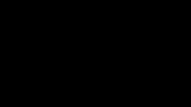

### About Me

My name is Pavel and I’m a software engineer. I work mostly with <b>Python</b> and <b>Django</b> to create systems related to machine learning. 
I’m a <b>Certified Kubernetes Application Developer</b> (CKAD) and have the ability to create, monitor and scale systems running on Kubernetes.  

💻 **Tech stack**: Python, Django, DRF, Kubernetes, Docker, Postgres, Helm, Pulumi  
💪 **Things I like**: 3D Printing, Hardware, Machine learning

### My Projects

<table border="0">

<tr><td>

<a href="https://github.com/pavelkraleu/deepclean"><b>Deep-Learning</b></a> - Lorem ipsum dolor sit amet, consectetur adipiscing elit. Vestibulum venenatis quam a vestibulum lobortis. Nunc bibendum efficitur risus quis gravida. Cras a consectetur velit, eget euismod elit. Ut at magna vel justo pharetra aliquet quis id mi. Ut ut lorem massa. Donec in augue ligula.
</td></tr>

<tr><td>

<a href="https://github.com/pavelkraleu/game-of-life"><b>Game of life</b></a> - Lorem ipsum dolor sit amet, consectetur adipiscing elit. Vestibulum venenatis quam a vestibulum lobortis. Nunc bibendum efficitur risus quis gravida. Cras a consectetur velit, eget euismod elit. Ut at magna vel justo pharetra aliquet quis id mi. Ut ut lorem massa. Donec in augue ligula.
</td></tr>

</table>

<table>
<tr><td></td><td></td><td></td><td></td><td></td></tr>
<tr>
	<td align="center"><a href="https://github.com/pavelkraleu/deepclean"><b>Deep-Learning</b></a> <small>AI Graffiti removal</small></td>
	<td align="center"><a href="https://eforce.cvut.cz/en/driverless/"><b>Self-driving</b></a> <small>CTU eForce</small></td>
	<td align="center"><a href="https://github.com/pavelkraleu/game-of-life"><b>Game of life</b></a> <small>C++ project</small></td>
	<td align="center"><a href="https://github.com/pavelkraleu/boiling-water"><b>Gas usage analysis</b></a> <small>Personal project</small></td>
	<td align="center"><a href="https://github.com/pavelkraleu/birdy-main"><b>Blockchain</b></a> <small>IoT Project</small></td>
</tr>
<tr><td></td><td></td><td></td><td></td><td></td></tr>
<tr>
	<td align="center"><a href="https://github.com/pavelkraleu/grid-fin-carnival"><b>3D Printing</b></a> <small>Carnival Mask</small></td>
	<td align="center"><a href="https://github.com/pavelkraleu/gardening-pot"><b>Gardening</b></a> <small>Gardening pot</small></td>
    <td></td>
    <td></td>
    <td></td>
	</tr>
</table>